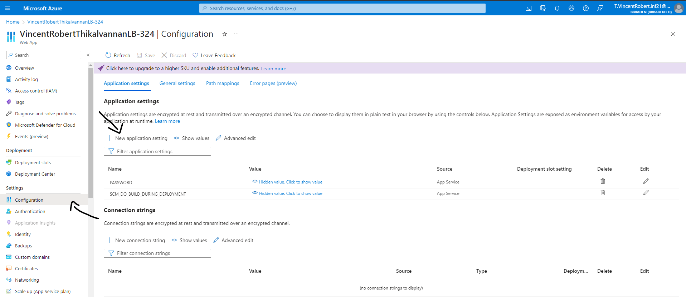
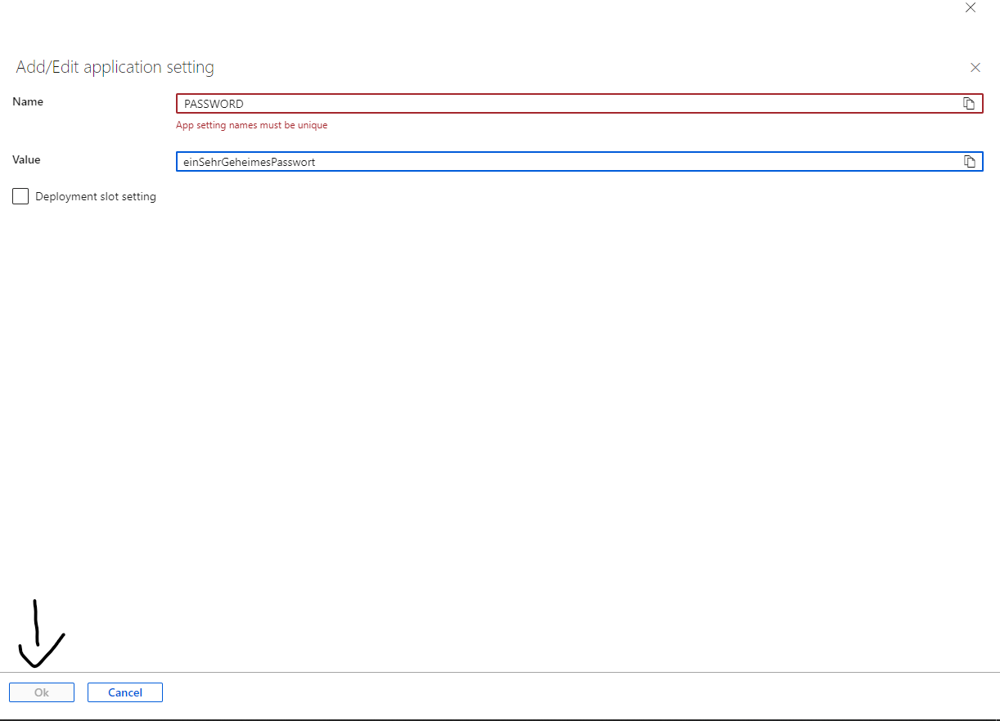

# LB 324

https://vincentrobertthikalvannanlb-324.azurewebsites.net/

## Aufgabe 2

Erklären Sie hier, wie man `pre-commit` installiert.

Installieren Sie pre-commit mit pip install pre-commit.

Erstellen Sie eine .pre-commit-config.yaml-Konfigurationsdatei im Projektverzeichnis.

Fügen Sie gewünschte Prüfungen wie flake8 und black hinzu.

Initialisieren Sie pre-commit mit pre-commit install.

Nun werden die Prüfungen vor jedem Commit automatisch ausgeführt.

Meine .pre-commit-config.yaml file:
repos:

- repo: https://github.com/ambv/black
  rev: 23.7.0
  hooks:

  - id: black
    language_version: python3.11

- repo: https://github.com/pre-commit/pre-commit-hooks
  rev: v2.0.0
  hooks:

  - id: check-yaml
  - id: check-added-large-files
  - id: mixed-line-ending
    args:
    - --fix=auto
  - id: trailing-whitespace
  - id: flake8
    args: ['--max-line-length', '100']

- repo: local
  hooks:
  - id: pytest-check
    stages: [commit]
    types: [python]
    name: pytest-check
    entry: python -m pytest
    language: system
    pass_filenames: false
    always_run: true

## Aufgabe 4

Erklären Sie hier, wie Sie das Passwort aus Ihrer lokalen `.env` auf Azure übertragen.

Klicken Sie in der Azure-Oberfläche auf 'Configuration' und dann auf 'New Application Settings'.

Im Feld 'Name' können Sie 'PASSWORD' eingeben und im Feld 'Value' Ihr Passwort eingeben. Anschließend klicken Sie auf 'OK'.

